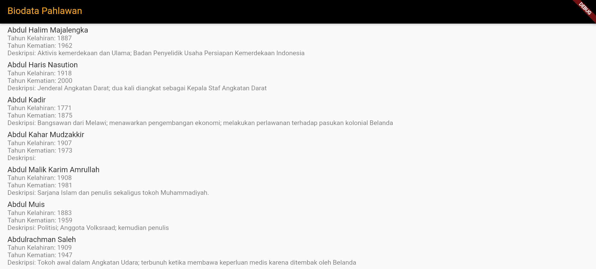

# UAS Pemrograman Mobile 2

## Profile

| #               | Biodata              |
| --------------- | -------------------- |
| **Nama**        | Afif Firmansyah      |
| **NIM**         | 312110232            |
| **Kelas**       | TI.21.A1             |
| **Mata Kuliah** | Pemrograman Mobile 2 |

## Daftar Isi

- [Profile](#profile)
- [Daftar Isi](#daftar-isi)
- [Requirements](#requirements)
- [Tutorial](#tutorial)

## Requirements

- [Flutter](https://docs.flutter.dev/get-started/install)

## Tutorial

- Pertama, Download Flutter sesuai dengan spesifikasi atau persyaratan komputer kalian.

| Operating System |                              URL                              |
| ---------------- | :-----------------------------------------------------------: |
| Windows          | [Link](https://docs.flutter.dev/get-started/install/windows)  |
| macOS            |  [Link](https://docs.flutter.dev/get-started/install/macos)   |
| Linux            |  [Link](https://docs.flutter.dev/get-started/install/linux)   |
| ChromeOS         | [Link](https://docs.flutter.dev/get-started/install/chromeos) |

- Kemudian, masuk ke halaman (Pahlawan API) dan klik pada tombol "Get API Key" di bagian atas kanan halaman.
- Daftar dengan akun kalian atau masuk jika kalian sudah memiliki akun.
- Setelah mendaftar/masuk, kalian akan diarahkan ke dashboard PahlawanAPI.
- Kemudian, buat project baru dalam direktori anda dengan nama yang kalian inginkan. Contoh:

```bash
flutter create BiodataPahlawan-app
```

- Lalu, pada direktori lib > main.dart hapus semua kode, kemudian ubah dengan kode ini:

```dart
import 'package:flutter/material.dart';
import 'package:hexcolor/hexcolor.dart';

import 'pages/splash_screen.dart';

void main() {
  runApp(LoginUiApp());
}

class LoginUiApp extends StatelessWidget {

  Color _primaryColor = HexColor('#AF0171');
  Color _accentColor = HexColor('#E80F88');

  // Design color
  // Color _primaryColor= HexColor('#FFC867');
  // Color _accentColor= HexColor('#FF3CBD');

  // Our Logo Color
  // Color _primaryColor= HexColor('#D44CF6');
  // Color _accentColor= HexColor('#5E18C8');

  // Our Logo Blue Color
  //Color _primaryColor= HexColor('#651BD2');
  //Color _accentColor= HexColor('#320181');

  // This widget is the root of your application.
  @override
  Widget build(BuildContext context) {
    return MaterialApp(
      title: 'Flutter Login UI',
      theme: ThemeData(
        primaryColor: _primaryColor,
        accentColor: _accentColor,
        scaffoldBackgroundColor: Colors.grey.shade100,
        primarySwatch: Colors.grey,
      ),
      home: SplashScreen(title: 'Flutter Login UI'),
    );
  }
}
```

- Dan jangan lupa menambahkan Library http pada file `pubspec.yaml`.

```dart
dependencies:
  flutter:
    sdk: flutter
  http: ^0.13.3
```

- Buka terminal, Kemudian run command `flutter pub get`.
- Setelah selesai, jalankan programnya with debugging.
- Maka hasilnya akan seperti ini :>



- Kode diatas dapat kalian improvisasi dengan kreasi kalian sendiri.

# Terima Kasih!!!
